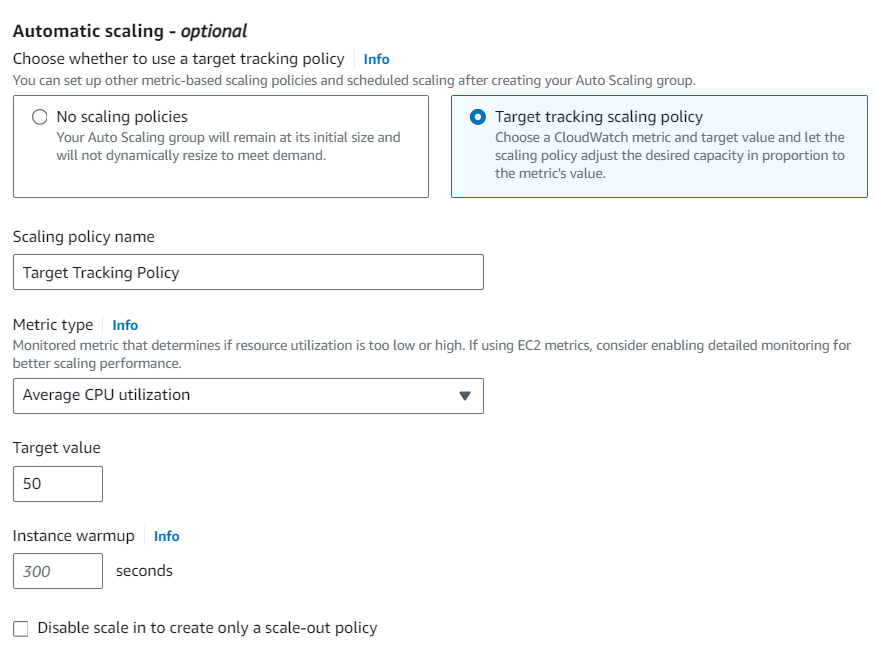

# Autoscaling Groups

- [Autoscaling Groups](#autoscaling-groups)
    - [Create a VM and an AMI](#create-a-vm-and-an-ami)
  - [Creating a Launch Template](#creating-a-launch-template)
  - [Testing our Launch Template](#testing-our-launch-template)
  - [Creating an Autoscaling Group](#creating-an-autoscaling-group)
    - [Availability Zones \& Subnets](#availability-zones--subnets)
    - [Health Checks](#health-checks)
    - [Load Balancer](#load-balancer)
    - [Listeners \& Routing](#listeners--routing)
    - [Sizes](#sizes)
    - [Scaling Policy](#scaling-policy)
    - [Tags](#tags)
    - [Instance Behaviour Policy](#instance-behaviour-policy)
      - [Mixed Behaviour](#mixed-behaviour)
      - [Prioritize Availability](#prioritize-availability)
      - [Control Costs](#control-costs)
      - [Custom Behaviour](#custom-behaviour)
  - [Testing ASG Through Load Balancer](#testing-asg-through-load-balancer)


An AWS Auto Scaling Group is a fundamental component of Amazon Web Services (AWS) that enables the automatic adjustment of the number of instances in a group to maintain application availability and optimize performance. This dynamic scaling capability is crucial for responding to changes in demand, allowing you to seamlessly scale resources up during traffic spikes and down during periods of reduced activity. By defining policies and setting parameters, such as desired capacity and health checks, the Auto Scaling Group automates the provisioning and termination of instances, ensuring your application's capacity aligns with the current workload. This scalability feature enhances system resilience, cost-efficiency, and responsiveness in cloud environments. 

### Create a VM and an AMI
We will need to successfully try and create our target application inside a VM using an AMI and App Data. It is important to follow the normal process of testing the application at each automation stage, and so we will obtain:
* An AMI used to create our application
* App Data used to launch our application

## Creating a Launch Template
Navigate to ```EC2 > Launch Templates``` and click the ```Create Launch Template``` button.

Follow the same rules as you would do to create an instance from an AMI. Namely we will need to fill out:
* Name
* Our AMI
* Our Instance Type
* Our Key-Pair value
* Our security group
* Our resource tag
* Our user data

We can **ignore**:
* Template version description
* Subnet (will be determined by ASG.)


## Testing our Launch Template
To test whether or not our Launch Template has the right configurations, checkbox the template to test and then under ```EC2 > Launch Templates``` and click the button ```Actions > Launch instance from template```.


Then you would run an arbritary method do check the deployment of an instance (in our case we would check the public ip and see if the website is running.)

## Creating an Autoscaling Group
We will create an Autoscaling Group by navigating to ```Auto scaling > Auto scaling groups``` and click Create Auto scaling Group.

### Availability Zones & Subnets
Select a specific VPC and the associated subnets (and hence AZs) to distribute the virtual machines inside during scaling.

### Health Checks
Provides a level of monitoring to your ASG system. In this case, we will check the Elastic Load Balancing option.

### Load Balancer
We can choose not to have, select an existing or create a new load balancer for our application. Our load balancer acts as the proxy to reroute users to a specific instance determined by workload of each instance. We will also need to check the Internet-facing option as our load-balancer will be accesed through the internet by its DNS name.

### Listeners & Routing
A target group in listeners and routing within AWS Auto Scaling groups acts as a traffic director, managing how incoming requests reach your instances. In this scenario, we will create a new Target Group.

### Sizes
* **Group Size:** Initial instances during initialisation of the ASG.
* **Min Capacity:** Minimum number of instances that should be running (to meet expected traffic demand)
* **Max Capacity:** Maximum number of instances that should be running (prevent over expenditure)

### Scaling Policy
Determines if your ASG should be scaled - by selecting Target Tracking Policy, the ASG will listen out for a specific metric exceeding a bound. In our case, we will scale if the average CPU utilization exceeds 50%.

### Tags
Simply put an associated tag to identify your instances. It is also good practice to capitalise instances only made by autoscaling groups.

### Instance Behaviour Policy
#### Mixed Behaviour

Achieve a balance between responsiveness and cost-efficiency with the Mixed Behaviour scaling policy. This approach combines the best of both by prioritizing availability during peak demand while actively controlling costs during periods of reduced activity. It's a versatile strategy suitable for applications with fluctuating yet crucial workloads, such as e-commerce platforms.

#### Prioritize Availability

- Ensures your application is always available, even during peak demand.
- Scales up rapidly to meet increased demand, prioritizing availability over cost considerations.
- Ideal for mission-critical applications where downtime is unacceptable, such as healthcare or financial systems.

#### Control Costs

- Minimizes operational expenditure by scaling up only when absolutely necessary.
- Focuses on maintaining the minimum required capacity to handle current demand.
- Suitable for applications with predictable workloads or where slight performance dips during low demand are acceptable.

#### Custom Behaviour

- Offers the most flexibility by allowing you to define your own scaling rules based on various metrics (e.g., CPU utilization, network traffic, or custom application health checks).
- Provides granular control over scaling behavior but requires careful configuration and monitoring.
- Best suited for applications with unique scaling needs or those requiring sophisticated performance optimization.





## Testing ASG Through Load Balancer
We will then need to navigate to our specific load balancer by finding it under ```Load Balancing > Load Balancer``` and filtering for our LB. Once selected, copy the ```DNS Name```.

