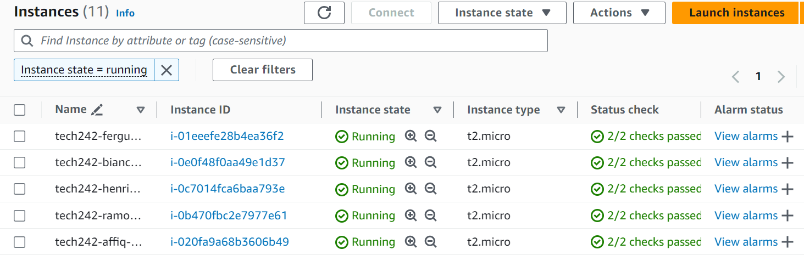

# Connecting to a Virtual Machine

## Prerequisites
* Ensure that you have stored the relevant .pem file in the .ssh folder in your local machine.
* Ensure you have created a virtual machine that is running, with the security group allowing SSH into the device from your specific IP



## Obtaining the SSH Link
Select the VM you would like to connect to and click the 'Connect' button located above the display to be redirected to a connection page. Select the SSH tab if it is not already selected and copy the command with the full parameters so that it may look something along the lines of 
```
 ssh -i "tech242.pem" ubuntu@ec2-52-211-124-75.eu-west-1.compute.amazonaws.com
```
Note that for instances where the VM is based off an existing AMI, the command may alter to a root user and so should be changed to ubuntu accordingly.
```
# Will not be able to connect with this
 ssh -i "tech242.pem" ubuntu@ec2-52-211-124-75.eu-west-1.compute.amazonaws.com
```

## Using Git BASH
Using Git BASH, navigate to the .ssh folder, which can be found in the typical path inside the user director. Normally the command ```cd ~/.ssh``` should bring you to the .ssh folder. You can then run the aforementioned ssh command to connect to the virtual machine.

Typically it may ask for a prompt about a fingerprint, in which case you may simply type 'yes'. Once the connection is sucessful, you may perform some Linux commands within the Git BASH terminal.

