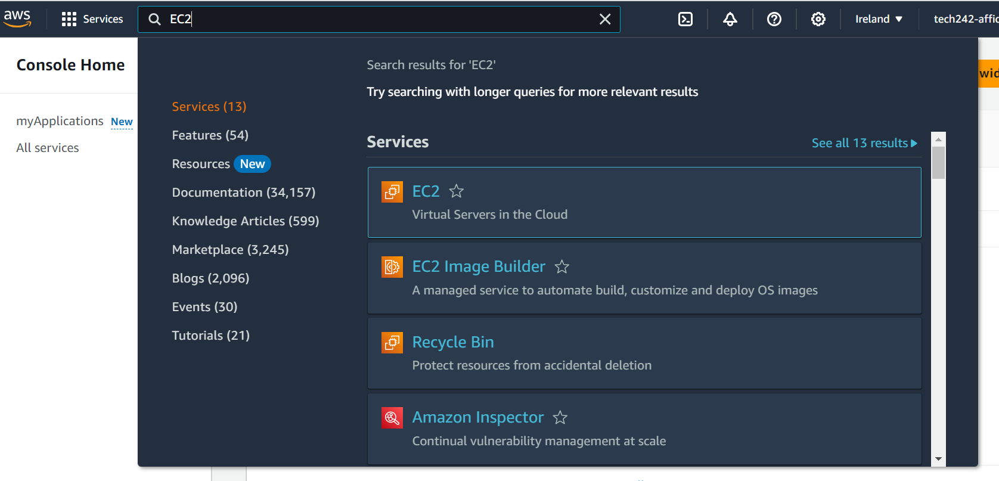

# Creating a Virtual Machine

- [Creating a Virtual Machine](#creating-a-virtual-machine)
  - [Goals:](#goals)
  - [Login:](#login)
  - [Creating an Instance of EC2:](#creating-an-instance-of-ec2)
  - [Configuring a new EC2:](#configuring-a-new-ec2)
    - [Naming](#naming)
    - [Amazon Machine Image](#amazon-machine-image)
    - [Instance Type](#instance-type)
    - [Key Pair Value](#key-pair-value)
    - [Security Groups](#security-groups)
    - [Confirmation](#confirmation)

## Goals:
We would like to safely create our first Amazon EC2 instance.

## Login:

* Head to the AWS console login.
* Enter your given AWS credentials:
  * Organization name
  * Email
  * Password.
* Go to the Search bar and look for 'EC2' to go to the appropriate VM tab.


  
## Creating an Instance of EC2:

* Click on the Instance tab to see all running VMs.
* Filters can be applied to look for local Virtual Machines.
* Click 'Launch Instance' to create a new instance.

## Configuring a new EC2:

### Naming
* Names are typically in the format `organisation-name-description`, for example, `tech242-affiq-test-vm`.

### Amazon Machine Image
* Select the appropriate Image to launch from (AMI) - this supplies the relevant Operating Systems, Run Time Environments and additional software and configurations.
* Typically, we use:
    ```
    ubuntu/images/hvm-ssd/ubuntu-bionic-18.04-amd64-server-20230424 (AMI ID: ami-0a7493ba2bc35c1e9)
    This can be located by filtering for `20230424`.
    ```

    

### Instance Type
* Choose the correct instance type - this determines resources such as VCPU and memory.
* To minimize costs, choose instance types with the AWS free tier tag.

### Key Pair Value
* Choose the correct key pair value.
* Key pairs can be self-managed (you generate your own .pem credentials) or managed by your organization.

### Security Groups
* Choose to create a new or an existing security group.
* Security groups manage traffic rules to your system.
* When creating a new group, ensure to allow SSH traffic from only your IP.
* Checkboxes allow multiple selects, so you can enable HTTP requests to the VM.
* Click the 'Edit' button for more configurations, such as giving meaningful names.
* Security groups can further define inbound and outbound traffic rules, including ports and protocols.


### Confirmation

* Review changes in the summary section on the right-hand side.
* Click 'Launch Instance'.

After the creation of a new instance, the VM should start running automatically.
