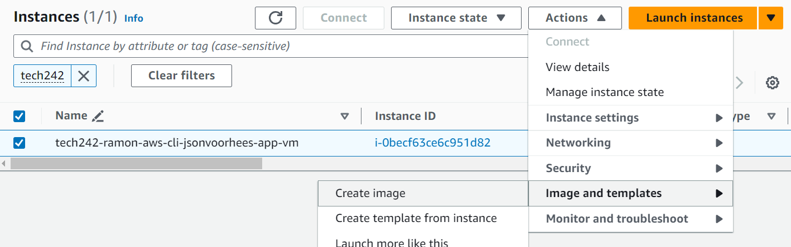

# File Transfer & Setting up a Java App

- [File Transfer \& Setting up a Java App](#file-transfer--setting-up-a-java-app)
  - [Goal:](#goal)
  - [Note:](#note)
  - [Transferring Files](#transferring-files)
    - [SCP](#scp)
  - [Setting up a Java App](#setting-up-a-java-app)
    - [Manual User Input](#manual-user-input)
    - [Updating and Upgrading](#updating-and-upgrading)
    - [Installing Maven](#installing-maven)
    - [Final Script](#final-script)
  - [Lauching VMs using User Data](#lauching-vms-using-user-data)
    - [Testing Strategy](#testing-strategy)
  - [Launching VMs with AMI](#launching-vms-with-ami)
    - [Instantiating through selected Image](#instantiating-through-selected-image)
    - [Removing AMIs](#removing-amis)
    - [Removing Associated Snapshots](#removing-associated-snapshots)


## Goal:
We would like to run a Spring Boot Application in our Virtual Machine, which can be accessed remotely through a number of machines using a web-browser. This document will highlight how we can transfer files to our Virtual Machine using Secure Copy or Git Clone. This document will also highlight the automation of starting the server through a BASH script, through User Data configuration in AWS, and finally speeding up efficiency by using Amazon Machine Images.

## Note:
We will be using Ubuntu's default AMI ```Canonical, Ubuntu, 22.04 LTS, amd64 jammy image build on 2023-09-19```

SCREENSHOT

## Transferring Files
A number of different file transfer protocols can be used. This document will try to outline some methods of transferring files from a local machine to a virtual machine. Ensure that the Virtual Machine is running before attempting file transfer.

### SCP
Secure Copy is a simple method of file transfer. It is outlined simply as:
```scp [options] source destination```
* However more specifically for a project, we must define the command in our local Git BASH terminal as ```scp -i <path-to-pem> <path-to-file> <vm-user>@<public-address>:<destination>```
* The i flag indicates that an identification, the pem file is required. For the reference to a pem file, it is best to insert a path relative to home directory so that it can be used anywhere. The same can be said about the path to file.
* The user specifies which home directory the file should be saved in, as well as the destination directory.
* The public address is **not** the IP seen in the terminal but rather the public IP address which can be found in the EC2 console.
* A fully fleshed out command for example will then look like ```scp -i ~/.ssh/tech242.pem ~/Documents/sendthisover.txt ubuntu@3.250.8.22:~```.
* To transfer folders, simply add the ```-r``` flag to allow recursive file/folder transfer instead.

SCREENSHOT

## Setting up a Java App
There are a few main steps we need. In the previous tutorial, we stated how to make a shell file, and outlining the main pseudosteps as comments. Again once we follow this process, we will need to manually test each step to verify they are suitable for automation.

### Manual User Input
* When performing some commands, some users might be either prompted with a CLI input i.e yes or no input. This can typically be bypassed by adding a ```-y``` flag to the end of the command. i.e.
```sudo apt upgrade -y```.
* When performing some commands, users might also be prompted with a graphical interfaces, in which case they can be bypassed using ```DEBIAN_FRONTEND=noninteractive``` i.e. ``` sudo DEBIAN_FRONTEND=noninteractive apt upgrade -y```

### Updating and Upgrading
* As with most BASH scripts, we need to deal with updating and upgrading the latest packages. This can be done with the ```sudo apt update``` and ```sudo apt upgrade``` command. As we are using the default Ubuntu LTS AMI, this will prompt an unexpected error - a visual display for user confirmation. Hence by adding the -y flags and the DEBIAN_FRONTEND variable mentioned earlier, we can circumvent this. And so this forms the first two steps of our BASH script.
* ```sudo apt update -y```
* ```sudo DEBIAN_FRONTEND=noninteractive apt upgrade -y```

### Installing Maven
* 

### Final Script

```
#!/bin/bash

# Update
echo "Updating"
sudo apt update -y
echo ""

# Upgrade
echo "Upgrading"
sudo DEBIAN_FRONTEND=noninteractive apt upgrade -y
echo ""

# Install maven
echo "Installing Maven"
sudo DEBIAN_FRONTEND=noninteractive apt install maven -y
echo ""

# Check maven install
echo "Checking Maven Install:"
mvn -version
echo ""

# Install JDK Java 17
echo "Installing JDK 17"
sudo DEBIAN_FRONTEND=noninteractive apt install openjdk-17-jdk -y
echo ""

# Check java version
echo "Checking Java Install:"
java -version
echo ""

# Clone App from Git
git clone https://github.com/Affiq/tech242-jsonvorhees-app.git

# CD into springapi folder
cd tech242-jsonvorhees-app/jsonvoorhees-java-atlas-app/springapi/

# Springboot start...
mvn spring-boot:start


```


## Lauching VMs using User Data
* User Data can be found in the advanced settings when creating a new EC2 instance, where a BASH script can be inserted (including the shebang).
* Code inserted here will execute once the VM starts running, and only once.
* Code that is inserted here will begin in the root directory ```/``` rather than the home directory ```/root/users/ubuntu```
* Code executed here will by default be with root, and so can be visualised as ```sudo <your command>```
* Code here should follow a BASH like syntax (so don't forget the **shebang!**)


### Testing Strategy
* It is difficult to validate whether a standard BASH script that is able to function is able to run in the user data section. However some steps can be taken to ensure this.
* By making use of relative paths and using root folder absolute paths when possible
* By moving the shell to the root directory, executing it there, and seeing if everything runs smoothly


```
#!/bin/bash

# Update
echo "Updating"
sudo apt update -y
echo ""

# Upgrade
echo "Upgrading"
sudo DEBIAN_FRONTEND=noninteractive apt upgrade -y
echo ""

# Install maven
echo "Installing Maven"
sudo DEBIAN_FRONTEND=noninteractive apt install maven -y
echo ""

# Check maven install
echo "Checking Maven Install:"
mvn -version
echo ""

# Install JDK Java 17
echo "Installing JDK 17"
sudo DEBIAN_FRONTEND=noninteractive apt install openjdk-17-jdk -y
echo ""

# Check java version
echo "Checking Java Install:"
java -version
echo ""

# Clone App from Git
git clone https://github.com/Affiq/tech242-jsonvorhees-app.git

# CD into springapi folder
cd tech242-jsonvorhees-app/jsonvoorhees-java-atlas-app/springapi/

# Springboot start...
mvn spring-boot:start

```

## Launching VMs with AMI
An Amazon Machine Image is a capture of the disk during a certain point in time whilst the Virtual Machine is running and can be used to launch other VMs with the same files and dependencies without the need for installation/updating. 

Once you have a running AMI with all the dependencies installed, a snapshot can be taken to have an AMI with all the dependencies installed. This can considerably boost the time of automation as this means the program does not need to run commands related to updating, upgrading, cloning folders and package installation (in our case we circumvent Java & Maven Installation, as well as Git cloning).
However this does mean we will need to still run the commands related to running our Spring Boot application.

To create an AMI of a running Virtual Machine, simply head to the EC2 console and select the target VM (ensuring that it is running). Once done, click the Actions button and head to 
```Actions > Image and Templates > Create Image```. After giving it appropriate names and tags. the image should then be created.



### Instantiating through selected Image
Navigate to the lefthand-side of the EC2 tabs and go to ```Images > AMI``` and search for your created image (using the filtering system and the appropriate tag you created). Once selected, simply click the ```Launch instance from AMI``` button. Once done, simply follow the regular configuration process (naming, security groups, etc) but with two exceptions:
* **Image Selection** - as we have selected the AMI itself, we will not need to worry about selecting the right image as it will be done for us.
* **User Data** - as mentioned before, we do not need to deal with specific commands when we have an AMI with expected dependencies and so some thought will be needed for this section. For this project specifically, we will only need to use commands related to start the spring boot server and to configure our reverse proxy.


### Removing AMIs
Given that we are completely finished with a project, we will need to delete an AMI and all its related snapshots as they may persist, after the deletion of our associated VMs. First, head to the AMI tab again and select the associated AMI to delete. After doing so head to the button ```Actions > Deregister AMI```. You will then be presented with a dialogue with a togglable block to ```Delete Associated Snapshots```. Click this and make a note of the associated snapshots before Deregistering the AMIs.


### Removing Associated Snapshots
Simply head to the tab ```Elastic Blockstore Volume > Snapshots``` and search for the noted snapshot. Simply click the button ```Actions > Delete Snapshot``` where the process itself should be simple.
