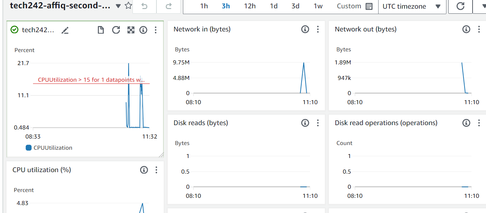

# Monitoring & Alert Management

If a service is overloaded with requests, they can potentially crash.
A metric is an aspect that can be monitored / measured.

Cloudwatch Monitoring is the service responsible for monitoring.
A dashboard typically contains charts, that allows you to visualise your metrics.

Need some form of testing to determine a 'critical point' for CPU usage - this is called load testing as the value could vary.

## Key Features:

1. **Proactive Monitoring:**
   - Monitor AWS resources in real-time.
   - Set up alarms to detect and respond to abnormal behavior.

2. **Dashboards:**
   - Create customizable dashboards to visualize key metrics.
   - Aggregate data from multiple sources for a high level view.

3. **Alarming:**
   - Set up alarms based on defined thresholds or anomalies.
   - Receive notifications via Amazon SNS for triggered alarms.

4. **Automation:**
   - Automate responses to alarms using AWS CloudWatch Events.
   - Integrate with AWS Lambda for serverless automation.

5. **Application Insights:**
   - Gain insights into application health with Application Insights.
   - Automatically discover and correlate application dependencies.

## Benefits of Monitoring

- **Proactive Countermeasures**
  Automate responses (Autoscaling / creating VMs to distribute load)

- **Performance Optimization:**
  Identify and resolve bottlenecks by analyzing detailed metrics.

- **Cost Management:**
  Optimize costs by understanding resource utilization patterns.

- **Availability and Uptime:**
  Monitor and ensure the availability of AWS resources and applications.

## Monitoring scenarios (worse to highest)


#### No monitoring
Risk of CPU being overloaded, and the machine falling over as traffic/load increases.

#### Manual Monitoring (Dashboard)
Need a person manually monitoring the dashboard - can be susceptible to spikes in traffic if monitoring is not constant.

#### Alert Monitoring
Automated alarm at a certain threshold, but response is manual. This is somewhat good, but requires a certain level of manual response, and can be unsuitable for international response teams as differing timezones means that manual response can be untimely.

### Autoscaling
Automated monitoring and response.

## Setting up Monitoring for EC2 Instance

#### Enable Monitoring
1. To enable EC2 Monitoring, simply head over to the desired EC2 instance under the Monitoring tab.
2. Select the Manage Detailed Monitoring button and simply click the Enable checkbox. **Use the same method to turn off detailed monitoring**.
3. Click the Add to Dashboard Button to head over to the dashboard page.


#### Creating a new dashboard
Once you have created the dashboard, simply head over to your dashboard to view the different graphs within your system.

#### Interacting with the dashboard
Highlight over the graph/metric to be observed to reveal a full-screen button. Click that to obsevre the graph in more detail. The first selection box allows you to change the intervals for the measurement while the second selection allows you to change the observed time period of the X-axis.


## Creating an Alarm

First navigate to the Cloudwatch console, and go to ```Alarms > All Alarms``` and click ```Create Alarm```.


Next, we will have to select a specific metric to monitor the state of. In this case, we can speed up by filtering for ec2 and cpu, and we can then select Cpuutilization under per instance.


We will also need to change our instance ID for our alarm.


We will then need to specify some specific conditions. We will create a static threshold of 15% for CPU utilization.


We can then choose to select an existing topic or create a new topic, which functions a bit like a mailing list.


Once the alarm is created, we will then need to confirm our subscription to the alarm before testing our alarm by overloading the system.


After overloading the system (which can be confirmed via the cloudwatch dashboard) we should then recieve a notification from the alarm.


