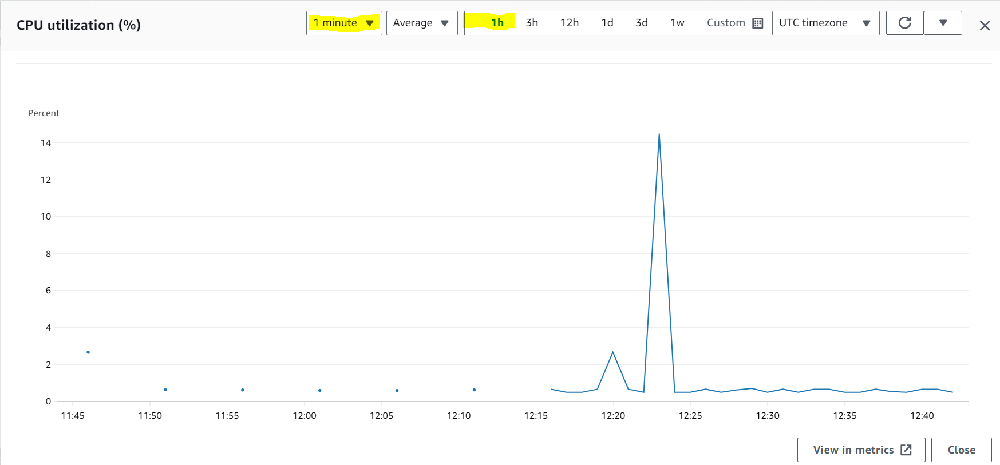

# Monitoring & Alert Management

If a service is overloaded with requests, they can potentially crash.
A metric is an aspect that can be monitored / measured.

Cloudwatch Monitoring is the service responsible for monitoring.
A dashboard typically contains charts, that allows you to visualise your metrics.

Need some form of testing to determine a 'critical point' for CPU usage - this is called load testing as the value could vary.

## Key Features:

1. **Proactive Monitoring:**
   - Monitor AWS resources in real-time.
   - Set up alarms to detect and respond to abnormal behavior.

2. **Dashboards:**
   - Create customizable dashboards to visualize key metrics.
   - Aggregate data from multiple sources for a high level view.

3. **Alarming:**
   - Set up alarms based on defined thresholds or anomalies.
   - Receive notifications via Amazon SNS for triggered alarms.

4. **Automation:**
   - Automate responses to alarms using AWS CloudWatch Events.
   - Integrate with AWS Lambda for serverless automation.

5. **Application Insights:**
   - Gain insights into application health with Application Insights.
   - Automatically discover and correlate application dependencies.

## Benefits of Monitoring

- **Proactive Countermeasures**
  Automate responses (Autoscaling / creating VMs to distribute load)

- **Performance Optimization:**
  Identify and resolve bottlenecks by analyzing detailed metrics.

- **Cost Management:**
  Optimize costs by understanding resource utilization patterns.

- **Availability and Uptime:**
  Monitor and ensure the availability of AWS resources and applications.

## Monitoring scenarios (worse to highest)

#### No monitoring
Risk of CPU being overloaded, and the machine falling over.

#### Manual Monitoring (Dashboard)
Need a person watching the dashboard

#### Alert Monitoring ()
Automated alarm at a certain threshold, but response is manual.

## Setting up Monitoring for EC2 Instance

#### Enable Monitoring
1. To enable EC2 Monitoring, simply head over to the desired EC2 instance under the Monitoring tab.
2. Select the Manage Detailed Monitoring button and simply click the Enable checkbox. **Use the same method to turn off detailed monitoring**.
3. Click the Add to Dashboard Button to head over to the dashboard page.

#### Creating a new dashboard
Once you have created the dashboard, simply head over to your dashboard to view the different graphs within your system.

#### Interacting with the dashboard
Highlight over the graph/metric to be observed to reveal a full-screen button. Click that to obsevre the graph in more detail. The first selection box allows you to change the intervals for the measurement while the second selection allows you to change the observed time period of the X-axis.

