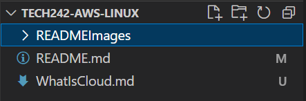

# Week 1 - AWS and Linux

- [Week 1 - AWS and Linux](#week-1---aws-and-linux)
  - [Day 1](#day-1)
  - [External Cloud Docs](#external-cloud-docs)
  - [Day 2](#day-2)

## Day 1
Commands:
* Ctrl + Shift + P -> Command Menu
* Ctrl + Shift + V -> Preview Markdown

## External Cloud Docs
[What is Cloud?](WhatIsCloud)

Storing SSH keys:

## Day 2

``