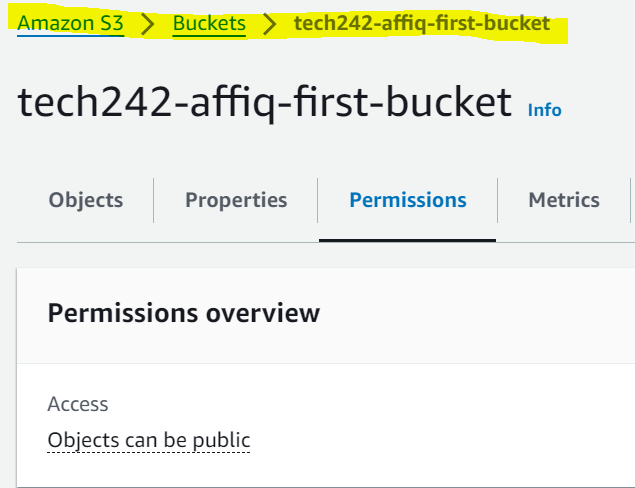
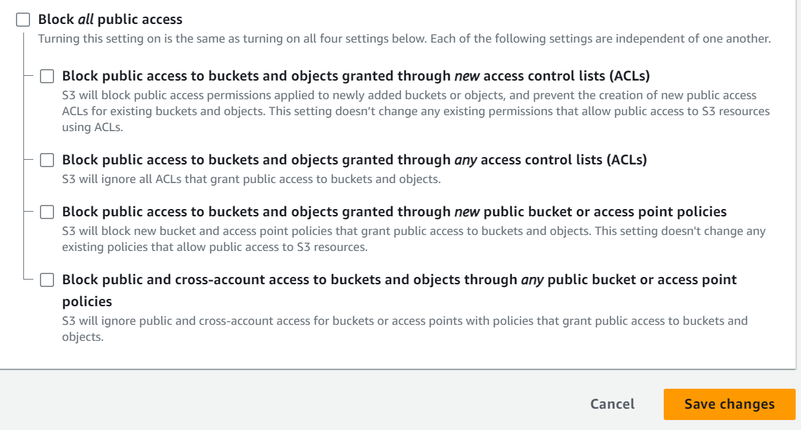
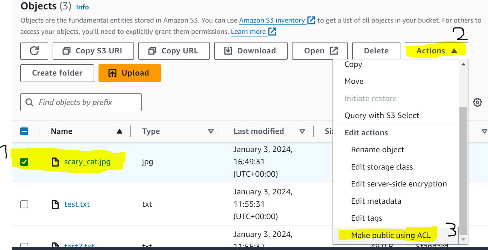

## Installing AWSCLI
We will first need to install the AWS CLI package so that we can communicate with AWS, done with the following command. You may add the -y flag and non debian interactive flag if you wish to bypass user input:
```sudo apt install awscli```
```non-interactive install```

We can verify the install using ```aws --version```, with which an output (which also verifies python version) confirms the installation.

## AWSCLI Configuration
After the installation, we will need 4 pieces of information:
* Access Key (may have to ask admin)
* Secret Access Key (may have to ask admin)
* Region (we will ``use eu-west-1``)
* Message format (we will use ``json``)

We will then use ```aws configure``` and enter the corresponding details from above.

## S3 Bucket Commands
```aws s3 help``` Lists all available aws s3 commands

#### Create bucket command

```aws s3 mb s3://<bucket-name>``` To create a bucket

#### List commands

```aws s3 ls``` List all buckets in organisations S3

```aws s3 ls s3://<bucket-name> ``` List all files in a bucket

#### Copy commands

```aws s3 cp <filename> s3://<bucket-name>``` Copy file into a bucket

```aws s3 cp s3://<bucket-name> <target-location>``` Copy bucket file into target location

```aws s3 sync s3://<bucket-name>``` Sync current folder with bucket (make all files up to date), typically needs to be done in an empty folder to avoid accidentally uploading accidental files.


#### Remove commands
```aws s3 rm s3://<bucket-name>/<file-name>``` Delete file from bucket

```aws s3 rb s3://tech242-affiq-first-bucket``` Remove a bucket (provided it is empty)

```aws s3 rb s3://tech242-affiq-first-bucket --force``` Remove a bucket and all files inside (**USE WITH CAUTION**)

## Make S3-File Public
Steps 1 and 2 need only to be performed once - if public access is already allowed alongside ACL, simply follow Step 3. 
Go to S3 console and navigate to your bucket.


1. Go to Permissions and turn "block public access" off to the following configuration
   



2. Go to Permissions and Enable ACL
3. Navigate to Objects and click the checkbox for <File-To-Publicise> and select ```Actions > Make Public Using ACL```



## Serving S3 Content from Spring Application
Typically in a Spring Application that uses Thymeleaf (a framework for serving HTML pages), content will be stored under ```src/main/resources/templates/<file-name>```, and typically the HTML page will have image tags inside them such as ``````. Given that we have a publicly accessible object, we can replace the src inside the tags directly to the s3 bucket file with the following format:

```.s3.amazonaws.com/<file-name>" >```

## Change Image BASH script

### Goal:
We would like to create a BASH script for our pre-existing json-vorhees application deployment. It should change the main image located in ```http://<public-vm-ip>/web/home``` to an image of our choice on S3.


