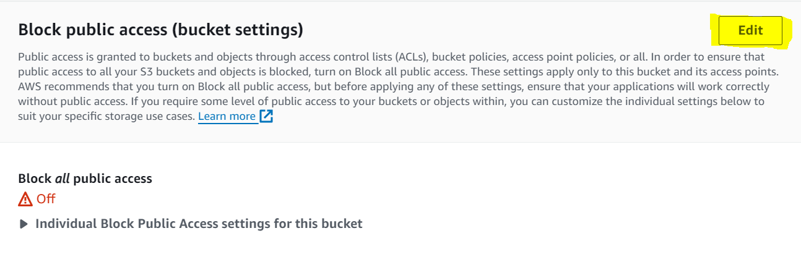

## Installing AWSCLI
We will first need to install the AWS CLI package so that we can communicate with AWS, done with the following command. You may add the -y flag and non debian interactive flag if you wish to bypass user input:
```sudo apt install awscli```
```non-interactive install```

We can verify the install using ```aws --version```, with which an output (which also verifies python version) confirms the installation.

## AWSCLI Configuration
After the installation, we will need 4 pieces of information:
* Access Key (may have to ask admin)
* Secret Access Key (may have to ask admin)
* Region (we will ``use eu-west-1``)
* Message format (we will use ``json``)

We will then use ```aws configure``` and enter the corresponding details from above.

## S3 Bucket Commands
```aws s3 help``` Lists all available aws s3 commands

#### Create bucket command

```aws s3 mb s3://<bucket-name>``` To create a bucket

#### List commands

```aws s3 ls``` List all buckets in organisations S3

```aws s3 ls s3://<bucket-name> ``` List all files in a bucket

#### Copy commands

```aws s3 cp <filename> s3://<bucket-name>``` Copy file into a bucket

```aws s3 cp s3://<bucket-name> <target-location>``` Copy bucket file into target location

```aws s3 sync s3://<bucket-name>``` Sync current folder with bucket (make all files up to date), typically needs to be done in an empty folder to avoid accidentally uploading accidental files.


#### Remove commands
```aws s3 rm s3://<bucket-name>/<file-name>``` Delete file from bucket

```aws s3 rb s3://tech242-affiq-first-bucket``` Remove a bucket (provided it is empty)

```aws s3 rb s3://tech242-affiq-first-bucket --force``` Remove a bucket and all files inside (**USE WITH CAUTION**)

## Make S3-File Public
Steps 1 and 2 need only to be performed once - if public access is already allowed alongside ACL, simply follow Step 3. 
Go to S3 console and navigate to your bucket.


1. Go to Permissions and turn "block public access" off to the following configuration
   



2. Go to Permissions and Enable ACL
3. Navigate to Objects and click the checkbox for <File-To-Publicise> and select ```Actions > Make Public Using ACL```


## Serving S3 Content from Spring Application
Typically in a Spring Application that uses Thymeleaf (a framework for serving HTML pages), content will be stored under ```src/main/resources/templates/<file-name>```, and typically the HTML page will have image tags inside them such as ``````. Given that we have a publicly accessible object, we can replace the src inside the tags directly to the s3 bucket file with the following format:

```.s3.amazonaws.com/<file-name>" >```

## Change Image BASH script

### Goal:
We would like to create a BASH script for our pre-existing json-vorhees application deployment. It should change the main image located in ```http://<public-vm-ip>/web/home``` to an image of our choice on S3.

We will first need to create a new bucket, turn off block access and download the image.

```
#!/bin/bash

# Create bucket
aws s3 mb s3://tech242-affiq-first-bucket

# Turn 'block access' off
aws s3api delete-public-access-block --bucket "tech242-affiq-first-bucket"

# Download scary cat image
wget -O scary_cat.jpg "https://s.yimg.com/ny/api/res/1.2/s4ZKTjCoae.sHWtfXJwgyw--/YXBwaWQ9aGlnaGxhbmRlcjt3PTY0MDtoPTQyOA--/https://media.zenfs.com/en/buzzfeed_articles_778/21a377cf0b3f1b5df6d9d5b98e8ec12b"
```

We would then need to upload to the bucket, and then change the policy from there.

```
# Upload to bucket without ACL
aws s3 cp scary_cat.jpg s3://tech242-affiq-first-bucket

# Change bucket policy
aws s3api put-bucket-policy --bucket tech242-affiq-first-bucket --policy '{
    "Version": "2012-10-17",
    "Statement": [
        {
            "Effect": "Allow",
            "Principal": "*",
            "Action": "s3:GetObject",
            "Resource": "arn:aws:s3:::tech242-affiq-first-bucket/*"
        }
    ]
}'

# Enable ACL
# aws s3api put-object-acl --bucket tech242-affiq-first-bucket --key scary-cat.jpg --acl public-read

```

We will then need to remove the image, change to the right directory and use the sed command to change the src of the image.

```

# Delete downloaded image
rm scary_cat.jpg

# Cd into right directory
cd /tech242-jsonvorhees-app/jsonvoorhees-java-atlas-app/springapi

# Change home.html 
sudo sed -i 's#src="/images/friday13th.jpg"#src="https://tech242-affiq-first-bucket.s3.amazonaws.com/scary_cat.jpg"#' /tech242-jsonvorhees-app/jsonvoorhees-java-atlas-app/springapi/src/main/resources/templates/home.html

# Repackage app (and run if necessary)
if curl http://localhost:80 | grep -q "Unavailable"; then
    echo "The word 'Unavailable' is present in the output: App not running"
    # Repackage maven file
    sudo mvn package spring-boot:start
else
    echo "The word 'Unavailable' is not present in the outpu: App is running."
    # Repackage maven file
    sudo mvn package
fi

```

## Remove Image Bash Script

We will first revert the image in the home.html file before repackaging in Maven.

```

#!/bin/bash

# Replace the URL in your HTML file
sudo sed -i 's#src="https://tech242-affiq-first-bucket.s3.amazonaws.com/scary_cat.jpg"#src="/images/friday13th.jpg"#' /tech242-jsonvorhees-app/jsonvoorhees-java-atlas-app/springapi/src/main/resources/templates/home.html

# Repackage maven file
# Cd into right directory
cd /tech242-jsonvorhees-app/jsonvoorhees-java-atlas-app/springapi

# Repackage app (and run if necessary)
if curl http://localhost:80 | grep -q "Unavailable"; then
    echo "The word 'Unavailable' is present in the output: App not running"
    # Repackage maven file
    sudo mvn package spring-boot:start
else
    echo "The word 'Unavailable' is not present in the output: App is running."
    # Repackage maven file
    sudo mvn package
fi
```

We will then remove the image from the bucket before removing the bucket itself.

```
# Remove image from bucket
aws s3 rm s3://tech242-affiq-first-bucket/scary_cat.jpg

# Remove bucket
aws s3 rb s3://tech242-affiq-first-bucket

```


