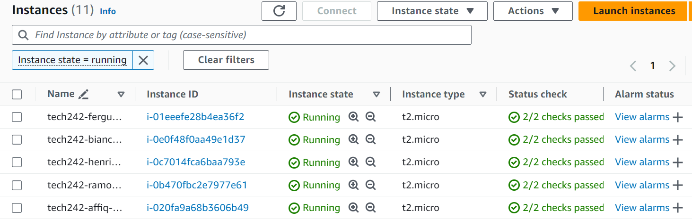

# Starting a Virtual Machine

Upon the creation of a new VM, the virtual machine should automatically be running.

## Observing States
The state of particular virtual machines can be observed through the EC2 console. Filters can be further applied to view running virtual machines or your specific VM by searching for the previously allocated name. In this case, we will filter for all running VMs. Likewise, we can filter for VMs that contain 'tech242' or 'affiq' in their names.

## Starting and Stopping VMs
Simply select the VM(s) to be run and click the Instance State button seen above. This will allow the option to 'Start Instance' which will then start the virtual machine. Likewise, this can be used to stop and even terminate VMs. Terminating a virtual machine does not terminate/destroy the associated AMI or snapshots, so some extra steps might be needed to delete them.