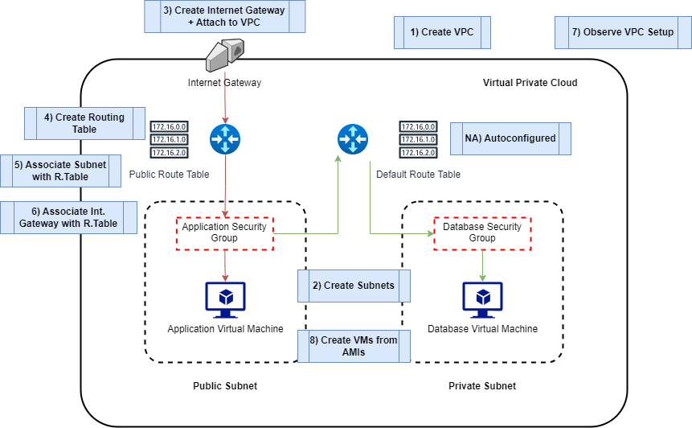

# Creating a VPC

## CIDR Blocks - Prerequisite Knowledge

### Definition

- **CIDR (Classless Inter-Domain Routing) Block:**
  - CIDR block is a notation used to represent a range of IP addresses. These can be attached to many components such as security groups, VPCs and Subnets.

### CIDR Block Format

- The CIDR block is written in the format: `192.168.0.0/24`.
- The number after the slash ("/") indicates the length of the network prefix.
  - In the example, `/24` uses the first 24 bits for the network, leaving 8 bits for individual addresses.

### Range of IP Addresses

- Example: `10.0.0.0/16` represents all IP addresses from `10.0.0.0` to `10.0.255.255`.
- The larger the number after the slash, the smaller the range.
  - `/24` represents 256 addresses, while `/16` represents 65,536 addresses.

CIDR notation simplifies the representation of IP address ranges, making it easier to manage and allocate address space in networking.

## VPC Architecture

## Steps to Setup a VPC
1) Create a VPC
2) Create Subnets
3) Create Internet Gateway and Attach to VPC
4) Create Routing Table
5) Associate Subnet with Routing Table
6) Associate Internet Gateway to Routing Table
7) Check VPC Setup
8) Create VMs from AMIs in relevant subnets

