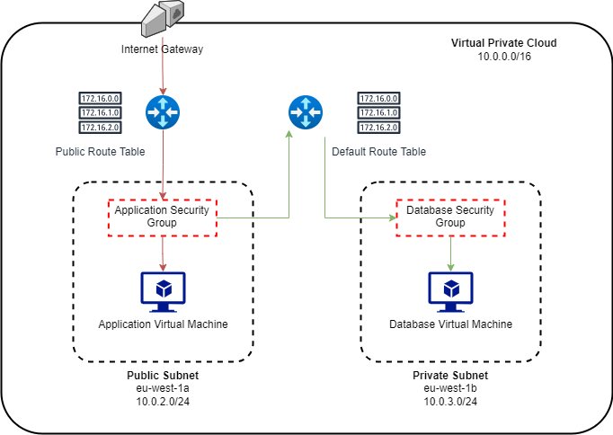

Virtual Private Clouds
The azure equivalent is a virtual network.
When creating a user, everyone is assigned a default VPC which is shared by everyone else.
Ireland region has 3 availability zones.
A subnet is associated with an availability zone.

A custom VPC can be made, where each subnet can be assigned to an availability zone, as well as determining if it is a public or private subnets.

Architecture within the VPCs determine if subnet is public or private.

Internal / Private traffic within the VPN is allowed due to internal routing table by default.

Internet gateway - 'part' that is publicly accesible to the internet, will need a public route table to expose specific subnets publicly.

## VPC Architecture

## Virtual Private Cloud (VPC):

- **Definition:** A Virtual Private Cloud (VPC) is a logically isolated section of the AWS Cloud where you can launch AWS resources. It acts as a virtual network dedicated to your AWS account.
  
- **Purpose:** VPCs allow you to define your own network topology, configure IP addresses, create subnets, and control the traffic flow between resources.

## Subnets:

- **Definition:** Subnets are subdivisions of a VPC. They are IP address ranges within the VPC, and you can think of them as segments of the overall network.
  
- **Purpose:** Subnets enable you to organize and isolate resources within a VPC. Each subnet can be associated with a specific availability zone.

## Availability Zones (AZs):

- **Definition:** AWS has multiple data centers called Availability Zones (AZs) within a geographical region. Each AZ is a separate, isolated facility with its own power, cooling, and networking.
  
- **Purpose:** Availability Zones are designed to provide high availability and fault tolerance. Placing resources across multiple AZs helps ensure that if one AZ experiences issues, your application can continue running in another.

## How They Relate:

1. **VPC and Subnets:**
   - A VPC encompasses all the subnets you create within it.
   - You can divide the IP address space of a VPC into multiple subnets, each with its own CIDR block.

2. **Subnets and Availability Zones:**
   - You can create subnets in different availability zones within a region.
   - Placing subnets in different AZs ensures that your resources are distributed across multiple physical locations for increased availability.

3. **High Availability with VPC, Subnets, and Availability Zones:**
   - By designing your architecture to span multiple subnets across different availability zones within a region, you achieve high availability and fault tolerance.
   - If one availability zone becomes unavailable, your application can still operate in other AZs.

In summary, a Virtual Private Cloud (VPC) allows you to define your own network in AWS, subnets are subdivisions of a VPC where you place resources, and Availability Zones are separate, isolated data centers within a region. Combining these concepts helps you create a resilient and highly available architecture in the cloud.

## AWS Routing Tables:

1. **VPC Routing Table:**
   - Each VPC in AWS has an associated route table. This table controls the routing for the VPC.
   - The VPC's main route table is associated with all subnets by default, but you can create additional custom route tables and associate them with specific subnets.

2. **Subnet Association:**
   - Subnets within a VPC can be associated with a specific route table.
   - By default, subnets are associated with the main route table, but you can customize this association to control the flow of traffic for each subnet.

3. **Route Entries:**
   - Route tables contain route entries that define how network traffic is directed. Each route entry specifies a destination (CIDR block) and a target (such as an internet gateway, VPC peering connection, or virtual private gateway).

4. **Internet Gateway:**
   - If a subnet's route table includes a route to an internet gateway, it allows instances in that subnet to communicate directly with the internet.

5. **Virtual Private Gateway and VPN Connections:**
   - You can use route tables to route traffic to a virtual private gateway, allowing communication between your VPC and on-premises networks via VPN (Virtual Private Network) connections.

6. **VPC Peering:**
   - For communication between VPCs, you can use VPC peering connections, and route tables are used to define the routing between peered VPCs.

